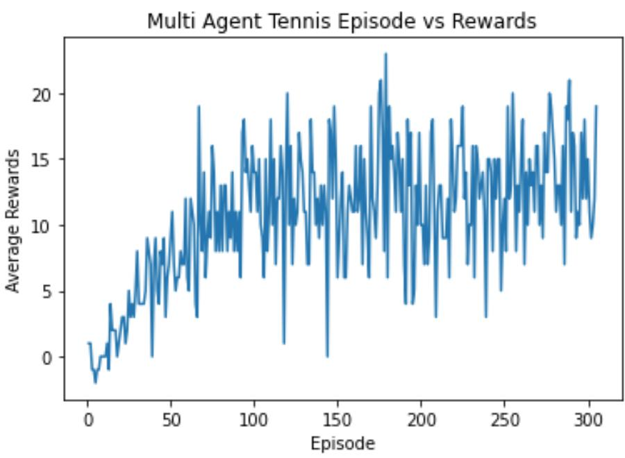

[//]: # (Image References)

[image1]: https://user-images.githubusercontent.com/10624937/42135619-d90f2f28-7d12-11e8-8823-82b970a54d7e.gif "Trained Agent"

# DQN - Banana Hunting

### Introduction

To train a reinforcement learning agent to hunt healthy bananas. This environment is simulated using Unity's Reacher Environment

![Trained Agent][image1]

### Project Details

1. Observation Space:
    - 37 variables contains the agent's velocity, along with ray-based perception of objects around agent's forward direction.
2. Action Space:
    - 4 variables corrensponding to move forward, backward, left, and right.
3. Rewarding Strategy:
    - if agent collected yellow healthy banana, received +1 as reward.
    - if agent collected blue poisoned banana, received -1 as reward.
4. Solution Requirement:
    - score a minimum average of +13 over a average 100 consecuitive episodes

### Implementation

1. Algorithm Approach: DQN
> This project is solved using Deep Q Network (DQN) approach.
 - DQN supports output of discrete action space.
 - DQN is a Q-value network that output Q-value of given state.
 - We take the largest DQN output value as the best action.

2. Hyper-Parameters:
> All parameters can be found in config.py.
 - BATCH_SIZE: 128 #minibatch size of inputs 
 - BUFFER_SIZE: 100000 #maximum buffer for replay buffer
 - GAMMA = 0.99 #discouunt rate for network
 - LR = 0.0005 #learning rate of dqn network

### Results

This project is solved in 304 episodes exceeding average rewards of 13. Below shows the results of training process over the time.

### Futuee Work

1. Try out with DDPG model to see if it could converge faster.
